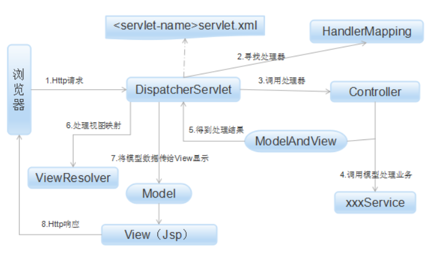

# SpringMVC

MVC 模式代表 Model-View-Controller（模型-视图-控制器） 模式。这种模式用于应用程序的分层开发。

- **Model（模型）** - 模型代表一个存取数据的对象或 JAVA POJO。它也可以带有逻辑，在数据变化时更新控制器。
- **View（视图）** - 视图代表模型包含的数据的可视化。
- **Controller（控制器）** - 控制器作用于模型和视图上。它控制数据流向模型对象，并在数据变化时更新视图。它使视图与模型分离开。

**MVC的优点：** 

[**1.**](http://lib.csdn.net/base/softwaretest)**[耦合性](http://baike.baidu.com/item/耦合性)低** 

视图层和业务层分离，这样就允许更改视图层代码而不用重新编译模型和控制器代码，同样，一个应用的业务流程或者业务规则的改变只需要改动MVC的模型层即可。因为模型与控制器和视图相分离，所以很容易改变应用程序的数据层和业务规则。

**2.重用性高** 

[MVC](http://baike.baidu.com/item/MVC模式)[模式](http://baike.baidu.com/item/MVC模式)允许使用各种不同样式的视图来访问同一个服务器端的代码，因为多个视图能共享一个模型，它包括任何WEB（HTTP）浏览器或者无线浏览器（wap），比如，用户可以通过电脑也可通过手机来订购某样产品，虽然订购的方式不一样，但处理订购产品的方式是一样的。由于模型返回的数据没有进行格式化，所以同样的构件能被不同的界面使用。

**3.部署快，生命周期成本低** 

MVC使开发和维护用户接口的技术含量降低。使用MVC模式使开发时间得到相当大的缩减，它使程序员（Java开发人员）集中精力于业务逻辑，界面程序员（HTML和JSP开发人员）集中精力于表现形式上。

**4.可维护性高** 

分离视图层和业务逻辑层也使得WEB应用更易于维护和修改。

**MVC的缺点：** 

**1.完全理解MVC比较复杂。** 

由于MVC模式提出的时间不长，加上同学们的实践经验不足，所以完全理解并掌握MVC不是一个很容易的过程。

**2.调试困难。** 

因为模型和视图要严格的分离，这样也给调试应用程序带来了一定的困难，每个构件在使用之前都需要经过彻底的测试。

**3.不适合小型，中等规模的应用程序** 

在一个中小型的应用程序中，强制性的使用MVC进行开发，往往会花费大量时间，并且不能体现MVC的优势，同时会使开发变得繁琐。

**4.增加系统结构和实现的复杂性** 

对于简单的界面，严格遵循MVC，使模型、视图与控制器分离，会增加结构的复杂性，并可能产生过多的更新操作，降低运行效率。

**5.视图与控制器间的过于紧密的连接并且降低了视图对模型数据的访问** 

视图与控制器是相互分离，但却是联系紧密的部件，视图没有控制器的存在，其应用是很有限的，反之亦然，这样就妨碍了他们的独立重用。

依据模型操作接口的不同，视图可能需要多次调用才能获得足够的显示数据。对未变化数据的不必要的频繁访问，也将损害操作性能。

## SpringMVC工作原理

### 理论

- SpringMVC工作原理：

1. 客户端发起请求（http）通过web.xml找到 DispatchServlet（前端控制器）；
2. 由DispatchServlet控制器通过配置文件（servletName-servlet.xml）寻找到一个或多个HandlerMapping（映射处理器），找到用于处理请求的controller（后端控制器）；
3. DispatchServlet将请求提交到controller；
4. Controller处理业务逻辑后，
5. controller返回数据 ModelAndVIew给DispatchServlet；
6. DispatchServlet寻找到一个或多个ViewResolver（视图解析器），找到ModelAndVIew指定的视图；
7. DispatchServle负责将结果返给View（客户端JSP页面），封装Http；
8. view响应页面的HTTP请求，返回响应数据，浏览器绘制页面。

**补充：**

1. **第2~3步，里面隐藏了步骤：**

DispatchServlet 根据 HandlerMapping（专门映射处理器的一个映射器）的配置（用户自己配置的配置文件）找到Handler（处理器），然后由具体的HandlerAdapter处理器对Handler进行处理。

1. **handler跟controller有啥区别？**

controller 是 handler，但是handler不是controller。

handler接管所有的DispatchServlet给与的处理信息，包括静态请求（http://……/style.css），并且可以改变请求所指向的资源参数如 String target参数。

controller只做三件事接收参数、调用业务、使用业务结果渲染页面。



**SpringMVC接口解释**

（1）**DispatcherServlet**接口：
Spring提供的前端控制器，所有的请求都有经过它来统一分发。在DispatcherServlet将请求分发给Spring Controller之前，需要借助于Spring提供的HandlerMapping定位到具体的Controller。
（2）**HandlerMapping**接口：
能够完成客户请求到Controller映射。
（3）**Controller**接口：
需要为并发用户处理上述请求，因此实现Controller接口时，必须保证线程安全并且可重用。
Controller将处理用户请求，这和Struts Action扮演的角色是一致的。一旦Controller处理完用户请求，则返回ModelAndView对象给DispatcherServlet前端控制器，ModelAndView中包含了模型（Model）和视图（View）。
从宏观角度考虑，DispatcherServlet是整个Web应用的控制器；从微观考虑，Controller是单个Http请求处理过程中的控制器，而ModelAndView是Http请求过程中返回的模型（Model）和视图（View）。
（4）ViewResolver接口：
Spring提供的视图解析器（ViewResolver）在Web应用中查找View对象，从而将相应结果渲染给客户。
4.**DispatcherServlet**：

是整个Spring MVC的核心。它负责接收HTTP请求组织协调Spring MVC的各个组成部分。其主要工作有以下三项：
（1）截获符合特定格式的URL请求。
（2）初始化DispatcherServlet上下文对应WebApplicationContext，并将其与业务层、持久化层的WebApplicationContext建立关联。
（3）初始化Spring MVC的各个组成组件，并装配到DispatcherServlet中。

### 代码

#### 1. web.xml

```xml
<!DOCTYPE web-app PUBLIC
        "-//Sun Microsystems, Inc.//DTD Web Application 2.3//EN"
        "http://java.sun.com/dtd/web-app_2_3.dtd" >

<web-app>
    <display-name>Archetype Created Web Application</display-name>

    <!--配置DispatcherServlet：请求分发器或者叫前端控制器是Srpingmvc核心。-->
    <servlet>
        <servlet-name>springmvc</servlet-name>
        <servlet-class>org.springframework.web.servlet.DispatcherServlet</servlet-class>

        <!--DispatcherServlet 绑定spring配置文件-->
        <init-param>
            <param-name>contextConfigLocation</param-name>
            <param-value>classpath:springmvc-servlet.xml</param-value>
        </init-param>

        <!--启动级别: 1 : 和服务器一起启动-->
        <load-on-startup>1</load-on-startup>
    </servlet>

    <!--
        /: 只匹配所有请求，不会匹配jsp页面
        /*：匹配所有请求，包括jsp页面
    -->
    <servlet-mapping>
        <servlet-name>springmvc</servlet-name>
        <url-pattern>/</url-pattern>
    </servlet-mapping>


</web-app>
```

#### 2. springmvc-servlet.xml

```xml
<?xml version="1.0" encoding="UTF-8"?>
<beans xmlns="http://www.springframework.org/schema/beans"
       xmlns:xsi="http://www.w3.org/2001/XMLSchema-instance"
       xsi:schemaLocation="http://www.springframework.org/schema/beans http://www.springframework.org/schema/beans/spring-beans.xsd">

    <!-- 处理器映射器 -->
    <bean class="org.springframework.web.servlet.handler.BeanNameUrlHandlerMapping"/>
    <!-- 处理器适配器 -->
    <bean class="org.springframework.web.servlet.mvc.SimpleControllerHandlerAdapter"/>
    <!-- 视图解析器 : 模板引擎 Thymeleaf Freemarker...-->
    <bean class="org.springframework.web.servlet.view.InternalResourceViewResolver" id="internalResourceViewResolver">
        <!--前缀-->
        <property name="prefix" value="/WEB-INF/jsp/"/>
        <!--后缀-->
        <property name="suffix" value=".jsp"/>
    </bean>

    <!--BeanNameUrlHandlerMapping处理器需要根据bean找url名字-->
    <bean id="hello" class="lv.controller.HelloController"/>

</beans>
```

#### 4.jsp

```jsp
<%--
  Created by IntelliJ IDEA.
  User: lv
  Date: 2021/8/7
  Time: 下午10:07
  To change this template use File | Settings | File Templates.
--%>
<%@ page contentType="text/html;charset=UTF-8" language="java" %>
<html>
<head>
    <title>Hello</title>
</head>
<body>
${msg}
</body>
</html>
```

#### 5.controller

```java
package lv.controller;

import org.springframework.web.servlet.ModelAndView;
import org.springframework.web.servlet.mvc.Controller;

import javax.servlet.http.HttpServletRequest;
import javax.servlet.http.HttpServletResponse;

public class HelloController implements Controller {

    @Override
    public ModelAndView handleRequest(HttpServletRequest httpServletRequest, HttpServletResponse httpServletResponse) throws Exception {
        ModelAndView mv = new ModelAndView();
        //业务代码
        String result = "HelloServletMVC";
        //数据封装  在jsp中可以拿到数据
        mv.addObject("msg", result);
        //试图跳转  设置jsp页面
        mv.setViewName("hello");
        return mv;
    }
}
```

### 使用注解配置

- springmvc-servlet.xml配置

```xml
<?xml version="1.0" encoding="UTF-8"?>
<beans xmlns="http://www.springframework.org/schema/beans"
       xmlns:xsi="http://www.w3.org/2001/XMLSchema-instance"
       xmlns:context="http://www.springframework.org/schema/context"
       xmlns:mvc="http://www.springframework.org/schema/mvc"
       xsi:schemaLocation="http://www.springframework.org/schema/beans http://www.springframework.org/schema/beans/spring-beans.xsd http://www.springframework.org/schema/context https://www.springframework.org/schema/context/spring-context.xsd http://www.springframework.org/schema/mvc https://www.springframework.org/schema/mvc/spring-mvc.xsd">

<!--自动扫描包-->
    <context:component-scan base-package="lv.controller"/>
    <mvc:default-servlet-handler/>
    <mvc:annotation-driven/>

    <!-- 视图解析器 : 模板引擎 Thymeleaf Freemarker...-->
    <bean class="org.springframework.web.servlet.view.InternalResourceViewResolver" id="internalResourceViewResolver">
        <!--前缀-->
        <property name="prefix" value="/WEB-INF/jsp/"/>
        <!--后缀-->
        <property name="suffix" value=".jsp"/>
    </bean>

    <!--BeanNameUrlHandlerMapping处理器需要根据bean找url名字-->
    <bean id="hello" class="lv.controller.HelloController"/>

</beans>
```

- controller

```java
package lv.controller;

import org.springframework.stereotype.Controller;
import org.springframework.ui.Model;
import org.springframework.web.bind.annotation.RequestMapping;

@Controller
public class AnnotationController {

    @RequestMapping("/hello")
    public String controller(Model model) {
        model.addAttribute("msg", "HelloSpringMVC");
        return "hello";
    }
}
```

## requestMapping

> 使用`@PathVariable`可以将参数赋值给mapping映射的路径上

```java
@RequestMapping("/hello/{a}/{b}")
    public String add(Model model, @PathVariable int a, @PathVariable String b) {
        model.addAttribute("msg", "HelloSpringMVC");
        return "hello";
    }
```


