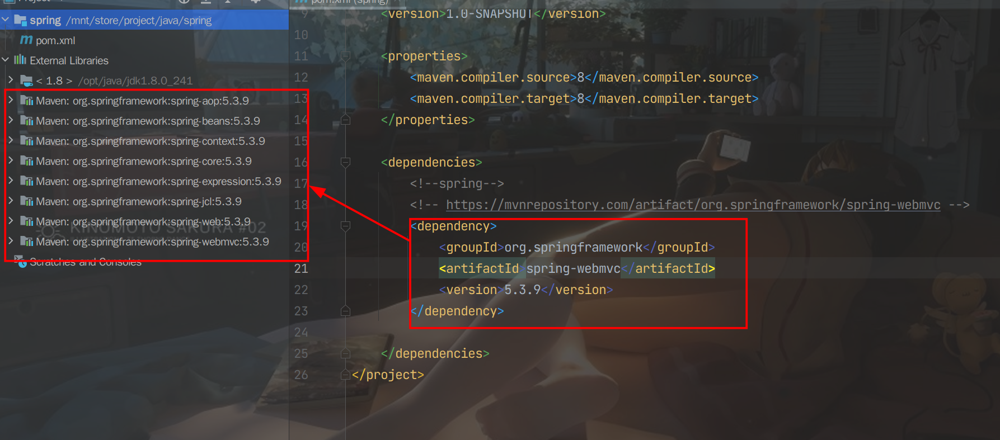
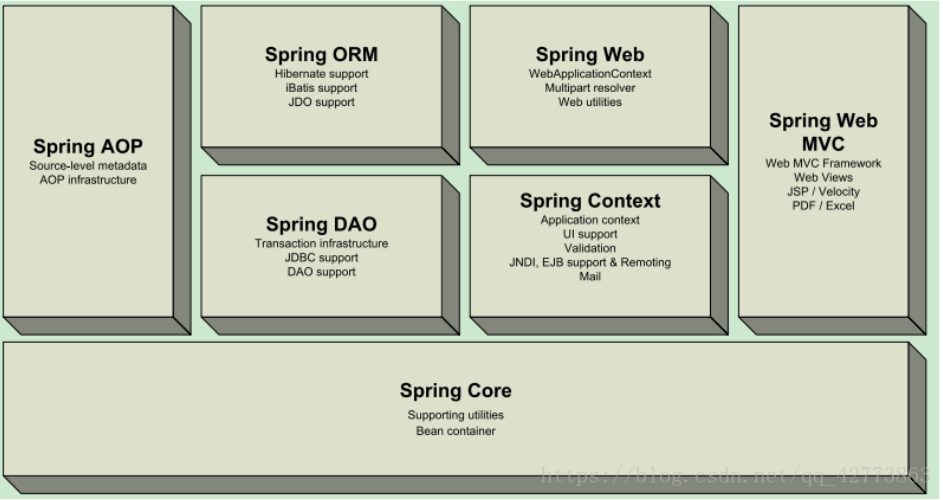
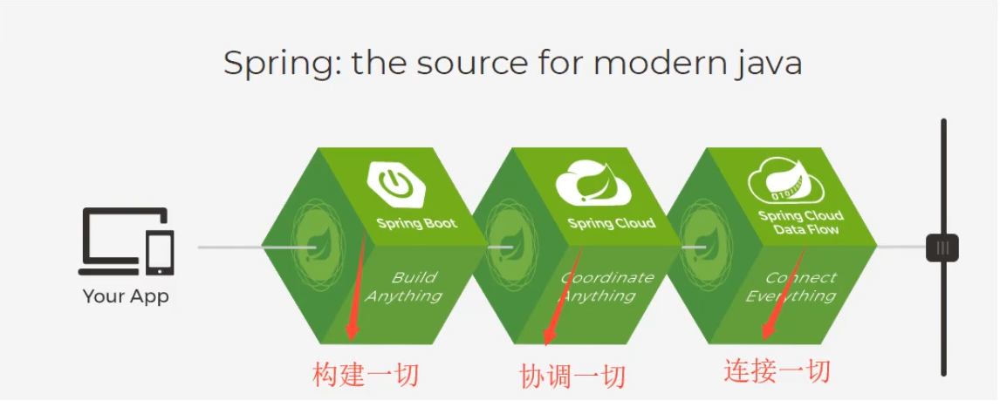

## 简介

Spring框架是一个[开放源代码](https://baike.baidu.com/item/开放源代码/114160)的[J2EE](https://baike.baidu.com/item/J2EE/110838)应用程序框架，由[Rod Johnson](https://baike.baidu.com/item/Rod Johnson/1423612)发起，是针对bean的生命周期进行管理的轻量级容器（lightweight container）。 Spring解决了开发者在J2EE开发中遇到的许多常见的问题，提供了功能强大IOC、[AOP](https://baike.baidu.com/item/AOP/1332219)及Web MVC等功能。Spring可以单独应用于构筑应用程序，也可以和Struts、Webwork、Tapestry等众多Web框架组合使用，并且可以与 Swing等[桌面应用程序](https://baike.baidu.com/item/桌面应用程序/2331979)AP组合。因此， Spring不仅仅能应用于J2EE应用程序之中，也可以应用于桌面应用程序以及小应用程序之中。Spring框架主要由七部分组成，分别是  Spring Core、 Spring AOP、 Spring ORM、 Spring DAO、Spring Context、 Spring  Web和 Spring Web MVC。

Spring Framework 为现代基于 Java 的企业应用程序提供了一个全面的编程和配置模型 - 在任何类型的部署平台上。 

Spring 的一个关键元素是应用程序级别的基础设施支持：Spring 专注于企业应用程序的“管道”，以便团队可以专注于应用程序级业务逻辑，而无需与特定部署环境产生不必要的联系。 

### 优点

- 开源免费的框架(容器)
- 轻量级、非入侵式的框架
- 控制反转（IOC），面向切面编程（AOP）
- 支持事物的处理，对框架整合的支持！

spring就是一个轻量级的控制反转（IOC）和面向切面编程（AOP）的框架。

## 导包

[maven](https://mvnrepository.com/?__cf_chl_captcha_tk__=pmd_837e67dcdc63e88ae2349dac7e145083cfb93412-1627479320-0-gqNtZGzNAuKjcnBszQii)搜索`spring`,导入`webmvc`包就会把所有的核心包都导进项目中

```xml
<!-- https://mvnrepository.com/artifact/org.springframework/spring-webmvc -->
<dependency>
    <groupId>org.springframework</groupId>
    <artifactId>spring-webmvc</artifactId>
    <version>5.3.9</version>
</dependency>
<dependency>
     <groupId>junit</groupId>
     <artifactId>junit</artifactId>
     <version>4.12</version>
</dependency>

```



## 模块组成



## 拓展

> 基于spring开发



- Spring boot
  - 一个快速开发的脚手架
  - 基于SpringBoot可以快速的开发单个微服务
  - 约定大于配置

- Spring Cloud
  - springCloud是基于SpringBoot实现的

##  常用注解

- `@Autowired` ：通过名字自动装配
  - `@Qualifier`： 如果`Autowired`不能唯一自动装配上属性，则要通过`@Qualifier(value = "xxx")`
  - `@Nullable` ： 字段可以为`null`
- `@Resource` ： 默认先通过名字，如果找不到再通过类型自动装配
- `@Component` ：组件 等价于<bean id="user" class="lv.pojo.User"/>，说明这个bean被Spring管理了

  

