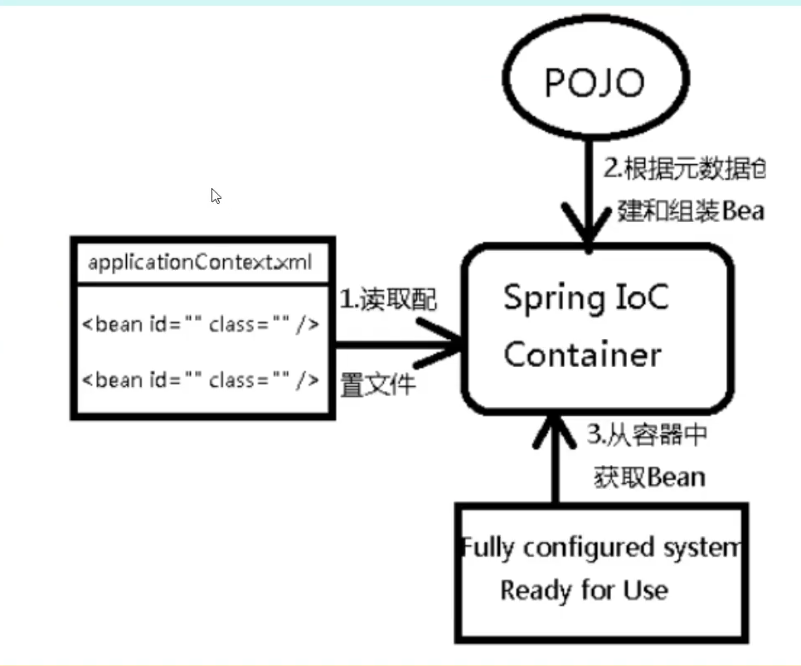
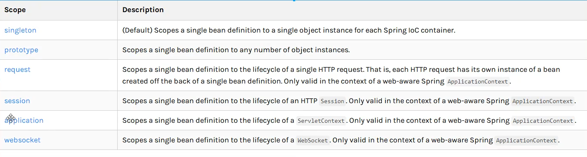
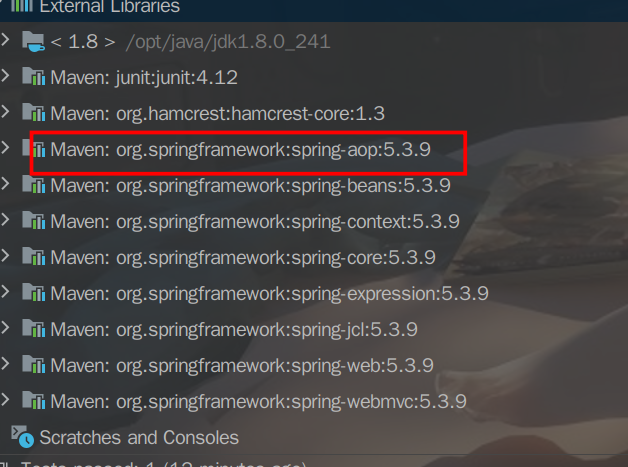
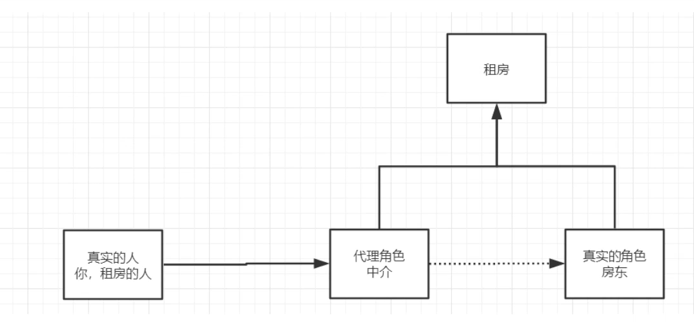
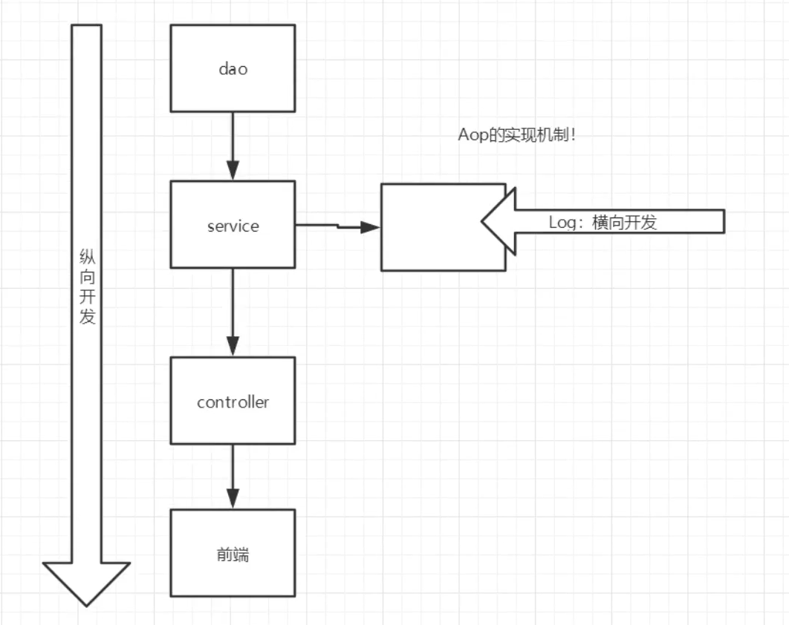
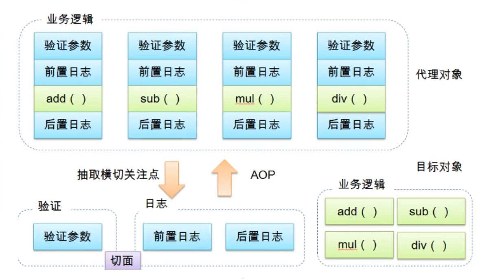
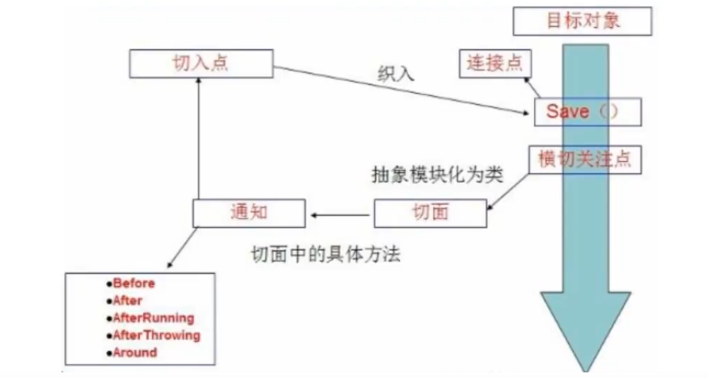
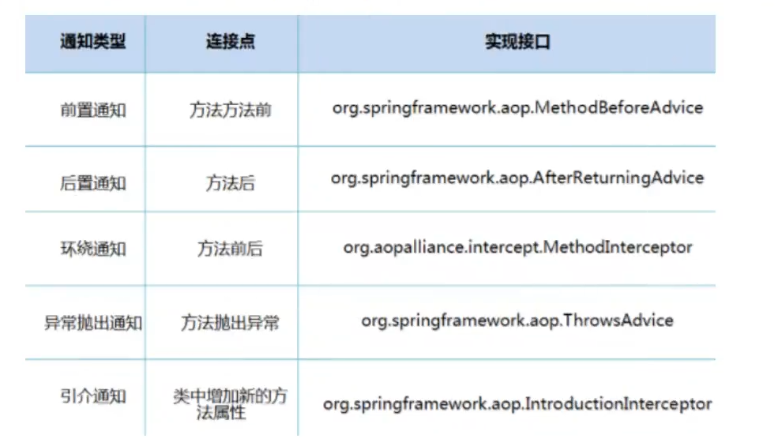

## 1. IOC理论推导

### 1.1. 原来的写法

#### 1.1.1  UserDao接口

```java
public interface UserDao {
    void getUser();
}
```


#### 1.1.2 UserDaoImpl实现类

```java
public class UserDaoImpl implements UserDao {
    @Override
    public void getUser() {
        System.out.println("默认获取用户数据");
    }
}
```


#### 1.1.3 UserService业务接口

```java
public interface IUserService {
    void getUser();
}
```


#### 1.1.4 UserServiceImpl业务实现类

```java
public class UserServiceImpl implements IUserService {
    private UserDao userDao = new UserDaoImpl();
    @Override
    public void getUser() {
        userDao.getUser();
    }
}
```

#### 1.1.5 UserTest测试

```java
public class UserTest {
    public static void main(String[] args) {
        //用户实际调用的业务层，Dao层不会直接调用
        IUserService userService = new UserServiceImpl();
        userService.getUser();
    }
}
```

缺点： 当Dao层需要增加需求时，service业务层的代码也需要跟着改变，耦合度太高

### 1.2 更改之后

#### 1.2.1 在业务层使用set方法获取dao实现

```java
public class UserServiceImpl implements IUserService {
    private UserDao userDao;
    public void setUserDao(UserDao userDao) {
        this.userDao = userDao;
    }
    @Override
    public void getUser() {
        userDao.getUser();
    }
}
```

#### 1.2.2 UserTest调用

```java
public class UserTest {
    public static void main(String[] args) {
        //用户实际调用的业务层，Dao层不会直接调用
        UserServiceImpl userService = new UserServiceImpl();
        userService.setUserDao(new UserDaoMysqlImpl());
        userService.getUser();
    }
}
```

- 这样在dao层添加新逻辑时，service不需要改动，只需要改变调用就可以，耦合度大大降低。

> 控制反转IOC（Inversion of Control），是一种设计思想，DI（依赖注入）是实现IOC的一种方法。IOC是Spring框架的核心内容。

> Spring容器在初始化时先读取配置文件，根据配置文件或元数据创建与组织对象存入容器中，程序使用时再从IOC容器中取出需要的对象。
>
> 
>
> 采用XML方式配置Bean的时候，Bean的定义信息是和实现分离的，而采用注解的方式可以把两者合为一体，Bean的定义信息直接以注解的形式定义在实现类中，从而达到了零配置的目的。

**控制反转是一种通过描述（XML或注解）并通过第三方去生产或获取特定对象的方式，在Sring中实现控制反转的是IOC容器，其实现方式是依赖注入（Dependency Injection,DI）。**

### 1.3 Hello示例

1. `Hello.Class`

   ```java
   public class Hello {
       private String str;
   
       public String getStr() {
           return str;
       }
   
       public void setStr(String str) {
           this.str = str;
       }
   
       @Override
       public String toString() {
           return "Hello{" +
                   "str='" + str + '\'' +
                   '}';
       }
   }
   ```

2.  `bean.xml`

   ```xml
   <?xml version="1.0" encoding="UTF-8"?>
   <beans xmlns="http://www.springframework.org/schema/beans"
          xmlns:xsi="http://www.w3.org/2001/XMLSchema-instance"
          xsi:schemaLocation="http://www.springframework.org/schema/beans http://www.springframework.org/schema/beans/spring-beans.xsd">
       <!--使用Spring创建对象，在Spring中这些都称为Bean-->
       <!--
       类型  变量名 =   new     类型（）
       Hello hello = new Hello();
   
       id: 变量名
       class: new 的对象
       property： 相当于给属性赋值
   	ref : 引用Spring容器中创建的对象
   	value： 给具体的属性赋值
       -->
       <bean id="hello" class="lv.Hello">
           <property name="str" value="Spring"/>
       </bean>
       <!--    <bean id="userDao" class="lv.dao.impl.UserDaoImpl"/>-->
   <!--    <bean id="userDaoMysql" class="lv.dao.impl.UserDaoMysqlImpl"/>-->
   
   <!--    <bean id="userService" class="lv.service.impl.UserServiceImpl">-->
   <!--        <property name="userDao" ref="userDao"/>-->
   <!--    </bean>-->
   </beans>
   ```

3. 测试类

   ```java
   import lv.Hello;
   import org.springframework.context.ApplicationContext;
   import org.springframework.context.support.ClassPathXmlApplicationContext;
   
   public class HelloTest {
       public static void main(String[] args) {
           //获取Spring的上下文对象
           ApplicationContext applicationContext = new ClassPathXmlApplicationContext("bean.xml");
           //获取XML中设置的bean
           Hello hello = (Hello) applicationContext.getBean("hello");
           System.out.println(hello);
       }
   }
   ```

- Hello对象是由Spring创建的
- Hello对象的属性由Spring容器设置

这个过程就叫控制反转：

控制：谁来控制对象的创建，传统应用程序的对象是由程序本身控制创建的，使用Spring后，对象是由Spring创建。

反转：程序本身不创建对象，而变成被动的接受对象。

依赖注入：利用set方法来进行注入的

IOC是一种编程思想，由主动的编程变成被动的接收。

> **对象由Spring来创建、管理、装配！**
>
> **在配置文件加载的时候，容器中的对象已经初始化**

## 2. 依赖注入

- 构造器注入

上面的就是构造器注入

- set方法注入

  - 依赖： bean对象的创建依赖于容器
  - 注入： bean对象中的所有属性，由容器来注入

  [环境搭建]

  1. 复杂类型

     ```java
     package lv;
     
     public class Address {
         private String address;
     
         public String getAddress() {
             return address;
         }
     
         public void setAddress(String address) {
             this.address = address;
         }
     
         @Override
         public String toString() {
             return "Address{" +
                     "address='" + address + '\'' +
                     '}';
         }
     }
     
     ```

     

  2. 真实测试对象

     ```java
     package lv;
     
     import java.util.*;
     
     public class Students {
         private String name;
         private Address address;
         private String[] books;
         private List<String> hobbys;
         private Map<String,String> card;
         private Set<String> games;
         private Properties info;
         private String wife;
     
         public String getName() {
             return name;
         }
     
         public void setName(String name) {
             this.name = name;
         }
     
         public Address getAddress() {
             return address;
         }
     
         public void setAddress(Address address) {
             this.address = address;
         }
     
         public String[] getBooks() {
             return books;
         }
     
         public void setBooks(String[] books) {
             this.books = books;
         }
     
         public List<String> getHobbys() {
             return hobbys;
         }
     
         public void setHobbys(List<String> hobbys) {
             this.hobbys = hobbys;
         }
     
         public Map<String, String> getCard() {
             return card;
         }
     
         public void setCard(Map<String, String> card) {
             this.card = card;
         }
     
         public Set<String> getGames() {
             return games;
         }
     
         public void setGames(Set<String> games) {
             this.games = games;
         }
     
         public Properties getInfo() {
             return info;
         }
     
         public void setInfo(Properties info) {
             this.info = info;
         }
     
         public String getWife() {
             return wife;
         }
     
         public void setWife(String wife) {
             this.wife = wife;
         }
     
         @Override
         public String toString() {
             return "Students{" +
                     "name='" + name + '\'' +
                     ", address=" + address +
                     ", books=" + Arrays.toString(books) +
                     ", hobbys=" + hobbys +
                     ", card=" + card +
                     ", games=" + games +
                     ", info=" + info +
                     ", wife='" + wife + '\'' +
                     '}';
         }
     }
     
     ```

  3. bean.xml

     ```java
     <?xml version="1.0" encoding="UTF-8"?>
     <beans xmlns="http://www.springframework.org/schema/beans"
            xmlns:xsi="http://www.w3.org/2001/XMLSchema-instance"
            xsi:schemaLocation="http://www.springframework.org/schema/beans http://www.springframework.org/schema/beans/spring-beans.xsd">
         <!--注入bean-->
         <bean id="address" class="lv.Address"/>
     
         <bean id="student" class="lv.Students">
             <!--第一种：普通的值注入，value-->
             <property name="name" value="斌"/>
             <!--第二种： bean注入，ref-->
             <property name="address" ref="address"/>
             <!--数组注入：ref-->
             <property name="books">
                 <array>
                     <value>西游记</value>
                     <value>红楼梦</value>
                     <value>三国</value>
                     <value>水浒</value>
                 </array>
             </property>
             <!--list注入：ref-->
             <property name="hobbys">
                 <list>
                     <value>听歌</value>
                     <value>打球</value>
                 </list>
             </property>
             <!--map注入： ref-->
             <property name="card">
                 <map>
                     <entry key="身份证" value="123456"/>
                     <entry key="银行卡" value="456789"/>
                 </map>
             </property>
             <!--set注入： ref-->
             <property name="games">
                 <set>
                     <value>LOL</value>
                     <value>GTA5</value>
                 </set>
             </property>
             <!--null注入-->
             <property name="wife">
                 <null/>
             </property>
             <!--properties注入： ref-->
             <property name="info">
                 <props>
                     <prop key="sql">mysql</prop>
                     <prop key="port">8080</prop>
                 </props>
             </property>
         </bean>
     </beans>
     ```

  4. 测试类

     ```java
     public static void main(String[] args) {
             ApplicationContext app = new ClassPathXmlApplicationContext("application.xml");
             Students student = (Students) app.getBean("student");
             System.out.println(student);
         //输出： Students{name='斌', address=Address{address='null'}, books=[西游记, 红楼梦, 三国, 水浒], hobbys=[听歌, 打球], card={身份证=123456, 银行卡=456789}, games=[LOL, GTA5], info={port=8080, sql=mysql}, wife='null'}
     
         }
     ```

     

- 拓展方式注入

  - p命名空间

    - 例子

      ```java
      package lv;
      
      public class User {
          private String name;
          private int age;
      
          public String getName() {
              return name;
          }
      
          public void setName(String name) {
              this.name = name;
          }
      
          public int getAge() {
              return age;
          }
      
          public void setAge(int age) {
              this.age = age;
          }
      
          @Override
          public String toString() {
              return "User{" +
                      "name='" + name + '\'' +
                      ", age=" + age +
                      '}';
          }
      
      }
      
      
      ```

    - bean.xml

      ```xml
      <?xml version="1.0" encoding="UTF-8"?>
      <beans xmlns="http://www.springframework.org/schema/beans"
             xmlns:xsi="http://www.w3.org/2001/XMLSchema-instance"
             xmlns:p="http://www.springframework.org/schema/p"
             xsi:schemaLocation="http://www.springframework.org/schema/beans http://www.springframework.org/schema/beans/spring-beans.xsd">
      
          <!--p命名空间 可以直接给属性注入值： property
              需要在上面配置上：xmlns:p="http://www.springframework.org/schema/p"
          -->
          <bean id="user" class="lv.User" p:name="名字" p:age="188"/>
      
      </beans>
      ```

    - 测试类

      ```java
      @org.junit.Test
          public void ptest() {
              ApplicationContext app = new ClassPathXmlApplicationContext("bean.xml");
              User user = (User) app.getBean("user");
              System.out.println(user);
          //输出： User{name='名字', age=188}
          }
      ```

  - c命名空间

    - 例子

      > 需要有构造器

      ```java
      package lv;
      
      public class User {
          private String name;
          private int age;
      
          public User() {
          }
      
          public User(String name, int age) {
              this.name = name;
              this.age = age;
          }
      
          public String getName() {
              return name;
          }
      
          public void setName(String name) {
              this.name = name;
          }
      
          public int getAge() {
              return age;
          }
      
          public void setAge(int age) {
              this.age = age;
          }
      
          @Override
          public String toString() {
              return "User{" +
                      "name='" + name + '\'' +
                      ", age=" + age +
                      '}';
          }
      
      }
      
      
      ```

    - bean.xml

      ```xml
      <?xml version="1.0" encoding="UTF-8"?>
      <beans xmlns="http://www.springframework.org/schema/beans"
             xmlns:xsi="http://www.w3.org/2001/XMLSchema-instance"
             xmlns:c="http://www.springframework.org/schema/c"
             xsi:schemaLocation="http://www.springframework.org/schema/beans http://www.springframework.org/schema/beans/spring-beans.xsd">
          
          <!--c命名空间 可以直接给属性注入值： 需要构造器
                  需要在上面配置上：xmlns:c="http://www.springframework.org/schema/c"
              -->
          <bean id="user2" class="lv.User" c:name="构造器" c:age="188"/>
      </beans>
      ```

    - 测试类

      ```java
      @org.junit.Test
          public void ptest() {
              ApplicationContext app = new ClassPathXmlApplicationContext("bean.xml");
              User user = (User) app.getBean("user2");
              System.out.println(user);
          //输出： User{name='构造器', age=188}
          }
      ```

## 3. bean作用域



1. 单例模式（Spring默认机制）

   > 只创建一个对象，所有bean共享一个对象

   ```xml
   <!--使用scope设置-->
   <bean id="user2" class="lv.User" c:name="构造器" c:age="188" scope="singleton"/>
   ```

2. 原型模式

   > 每一个bean都创建一个单独的对象

   ```java
   <bean id="user2" class="lv.User" c:name="构造器" c:age="188" scope="prototype"/>
   ```

3. 其他的只能在web开发中使用到

## 4. bean自动装配

- 自动装配是Spring满足bean依赖的一种方式
- Spring会在上下文中自动寻找，并自动给bean装配属性

在spring中有三种装配方式

1. 在xml中显示的配置
2. 在java中显示配置
3. 隐式的自动装配bean「重要」

### 自动装配测试

- 例子

  ```java
  public class Cat {
      public void shout(){
          System.out.println("瞄");
      }
  }
  
  
  public class Dog {
      public void shout(){
          System.out.println("汪");
      }
  }
  
  
  package lv;
  
  public class People {
      private Dog dog;
      private Cat cat;
      private String name;
  
      public Dog getDog() {
          return dog;
      }
  
      public void setDog(Dog dog) {
          this.dog = dog;
      }
  
      public Cat getCat() {
          return cat;
      }
  
      public void setCat(Cat cat) {
          this.cat = cat;
      }
  
      public String getName() {
          return name;
      }
  
      public void setName(String name) {
          this.name = name;
      }
  
      @Override
      public String toString() {
          return "People{" +
                  "dog=" + dog +
                  ", cat=" + cat +
                  ", name='" + name + '\'' +
                  '}';
      }
  }
  
  ```

- bean.xml

  ```xml
  <?xml version="1.0" encoding="UTF-8"?>
  <beans xmlns="http://www.springframework.org/schema/beans"
         xmlns:xsi="http://www.w3.org/2001/XMLSchema-instance"
         xsi:schemaLocation="http://www.springframework.org/schema/beans http://www.springframework.org/schema/beans/spring-beans.xsd">
  
      <bean id="dog" class="lv.Dog"/>
      <bean id="cat" class="lv.Cat"/>
      <!--普通的写法-->
      <!--    <bean id="people" class="lv.People">-->
      <!--        <property name="name" value="小明"/>-->
      <!--        <property name="cat" ref="cat"/>-->
      <!--        <property name="dog" ref="dog"/>-->
      <!--    </bean>-->
      <!--自动装配 autowire:
          byName ： 会自动在容器上下文中查找，和自己对象set方法后面的值对应的beanid
          byType : 会自动在容器上下文中查找，和自己对象属性类型相同的bean
      -->
      <bean id="people" class="lv.People" autowire="byName">
          <property name="name" value="小明"/>
      </bean>
  </beans>
  ```

  

- 测试类

  ```java
   @org.junit.Test
      public void peopletest() {
          ApplicationContext app = new ClassPathXmlApplicationContext("bean.xml");
          People people = app.getBean("people", People.class);
          people.getCat().shout();
          people.getDog().shout();
      }
  ```

> byname： 需要保证所有bean的id唯一，并且需要和自动注入的属性的set方法的值一致
>
> bytype ： 需要保证所有bean的class唯一，并且需要和自动注入的属性的类型一致

### 使用注解自动装配

> JDK1.5，Spring2.5支持注解

- 导入约束

- 配置注解支持

  ```xml
  <?xml version="1.0" encoding="UTF-8"?>
  <beans xmlns="http://www.springframework.org/schema/beans"
         xmlns:xsi="http://www.w3.org/2001/XMLSchema-instance"
         xmlns:context="http://www.springframework.org/schema/context"
         xsi:schemaLocation="http://www.springframework.org/schema/beans
          http://www.springframework.org/schema/beans/spring-beans.xsd
          http://www.springframework.org/schema/context
          http://www.springframework.org/schema/context/spring-context.xsd">
  
      <!--需要导入 xmlns:context="http://www.springframework.org/schema/context"
          在xsi:schemaLocation中加入 ： http://www.springframework.org/schema/context
          http://www.springframework.org/schema/context/spring-context.xsd"-->
      <!--开启注解支持-->
      <context:annotation-config/>
      
      <bean id="dog" class="lv.Dog"/>
      <bean id="cat" class="lv.Cat"/>
      <bean id="people" class="lv.People"/>
  </beans>
  ```

  测试：

  在bean上加注解`@Autowired`

  ```java
  package lv;
  
  import org.springframework.beans.factory.annotation.Autowired;
  
  public class People {
      @Autowired
      private Dog dog;
      @Autowired
      private Cat cat;
      private String name;
  
      public Dog getDog() {
          return dog;
      }
  
      public void setDog(Dog dog) {
          this.dog = dog;
      }
  
      public Cat getCat() {
          return cat;
      }
  
      public void setCat(Cat cat) {
          this.cat = cat;
      }
  
      public String getName() {
          return name;
      }
  
      public void setName(String name) {
          this.name = name;
      }
  
      @Override
      public String toString() {
          return "People{" +
                  "dog=" + dog +
                  ", cat=" + cat +
                  ", name='" + name + '\'' +
                  '}';
      }
  }
  
  ```

5. ## 使用注解开发

   1. 在Spring4之后，使用注解开发必须保证aop包导入

   

使用注解需要导入context约束，增加注解支持

```xml
<?xml version="1.0" encoding="UTF-8"?>
<beans xmlns="http://www.springframework.org/schema/beans"
       xmlns:xsi="http://www.w3.org/2001/XMLSchema-instance"
       xmlns:context="http://www.springframework.org/schema/context"
       xsi:schemaLocation="http://www.springframework.org/schema/beans
        http://www.springframework.org/schema/beans/spring-beans.xsd
        http://www.springframework.org/schema/context
        http://www.springframework.org/schema/context/spring-context.xsd">

    <!--需要导入 xmlns:context="http://www.springframework.org/schema/context"
        在xsi:schemaLocation中加入 ： http://www.springframework.org/schema/context
        http://www.springframework.org/schema/context/spring-context.xsd"-->
    <!--开启注解支持-->
    <context:annotation-config/>

</beans>
```

2. 属性注入

   ```java
   package lv.pojo;
   
   import org.springframework.beans.factory.annotation.Value;
   import org.springframework.stereotype.Component;
   
   /**
    * @Component： 组件 等价于： <bean id="user" class="lv.pojo.User"/>
    */
   @Component
   public class User {
       /**
        * @Value("小明")：给属性赋值 等价于 <property name="name" value="小明"/>
        */
       @Value("小明")
       public String name;
       
   //    @Value("小明")
   //    public void setName(String name) {
   //        this.name = name;
   //    }
   }
   
   ```

3. 衍生的注解

   `@Component`衍生注解

   - `@Repository` : dao层注解

   - `@Service` : service层注解

   - `@Controller` : controller层注解

     > 都代表将类注入到Srping中，装配bean

## 5. 使用java方式配置Spring

完全不使用xml，全部交给java

> javaConfig是一个子项目，在Spring4之后成为核心功能

- 实体类

  ```java
  package lv.pojo;
  
  import org.springframework.beans.factory.annotation.Value;
  import org.springframework.stereotype.Component;
  
  @Component
  public class User {
      @Value("小明")
      private String name;
      @Value("18")
      private int age;
  
      public String getName() {
          return name;
      }
  
      public void setName(String name) {
          this.name = name;
      }
  
      public int getAge() {
          return age;
      }
  
      public void setAge(int age) {
          this.age = age;
      }
  
      @Override
      public String toString() {
          return "User{" +
                  "name='" + name + '\'' +
                  ", age=" + age +
                  '}';
      }
  }
  
  ```

  

- 配置类

  ```java
  package lv.config;
  
  import lv.pojo.User;
  import org.springframework.context.annotation.Bean;
  import org.springframework.context.annotation.Configuration;
  
  /**
   * @Configuration: 配置类，相当于原来的xml
   */
  @Configuration
  public class LvConfig {
  
      @Bean
      public User getUser() {
          return new User();
      }
  }
  
  ```

  

- 测试类

  ```java
  import lv.config.LvConfig;
  import lv.pojo.User;
  import org.springframework.context.ApplicationContext;
  import org.springframework.context.annotation.AnnotationConfigApplicationContext;
  
  public class Test {
      public static void main(String[] args) {
          ApplicationContext app = new AnnotationConfigApplicationContext(LvConfig.class);
          User user = app.getBean("getUser", User.class);
          System.out.println(user);
      }
  }
  
  ```

## 6. 代理模式

- 静态代理
- 动态代理



### 6.1. 静态代理

角色分析：

- 抽象角色：一般会使用接口或抽象类解决
- 真实角色： 被代理的角色
- 代理角色： 代理真实角色后，一般会做一些附属操作
- 客户： 访问代理对象的人

代码步骤：

1. 接口

   ```java
   //租房
   public interface Rent {
       void rent();
   }
   ```

   

2. 真实角色

   ```java
   //房东
   public class Host implements Rent{
       @Override
       public void rent() {
           System.out.println("房东要租房");
       }
   }
   ```

   

3. 代理角色

   ```java
   package lv.demo01;
   
   public class Proxy implements Rent {
       private Host host;
   
       public Proxy() {
       }
   
       public Proxy(Host host) {
           this.host = host;
       }
   
       @Override
       public void rent() {
           seeHonse();
           host.rent();
       }
   
       private void seeHonse() {
           System.out.println("中介看房");
       }
   }
   
   ```

   

4. 客户访问

   ```java
   public static void main(String[] args) {
           Proxy proxy = new Proxy(new Host());
           proxy.rent();
       }
   ```

   

代理模式的好处：

- 可以是真实角色的操作更加纯粹！不去关注公共业务
- 公共业务交给代理，实现业务分工
- 公共业务扩展的时候，方便集中管理

缺点：

- 一个真实角色就会产生一个代理角色；开发效率太低



### 6.2. 动态代理

- 和静态代理角色一样
- 动态代理的代理类是动态生成的
- 动态代理分为两大类
  - 基于接口的动态代理
    - JDK动态代理
  - 基于类的动态代理
    - cglib
  - java字节码实现
    - javassist

需要了解两个类：Proxy：代理,  invocationHandler: 调用处理程序

1. 接口

   ```java
   //租房
   public interface Rent {
       void rent();
   }
   ```

2. 真实对象

   ```java
   //房东
   public class Host implements Rent {
       @Override
       public void rent() {
           System.out.println("房东要租房");
       }
   }
   ```

3. 处理程序

   ```java
   package lv.demo02;
   
   import java.lang.reflect.InvocationHandler;
   import java.lang.reflect.Method;
   import java.lang.reflect.Proxy;
   
   /**
    * 自动生成代理类
    */
   public class ProxyInvocationHandler implements InvocationHandler {
       //被代理的接口
       private Object obj;
   
       //处理代理实例并返回结果
       @Override
       public Object invoke(Object proxy, Method method, Object[] args) throws Throwable {
           Object invoke = method.invoke(obj, args);
           return invoke;
       }
   
       //得到生成的代理类
       public Object getProxy() {
           return Proxy.newProxyInstance(this.getClass().getClassLoader(), obj.getClass().getInterfaces(), this);
       }
   
       public void setObj(Object obj) {
           this.obj = obj;
       }
   }
   
   ```

4. 调用

   ```java
   package lv.demo02;
   
   public class Test {
       public static void main(String[] args) {
           //真实角色
           Host host = new Host();
           //代理角色： 现在没有
           ProxyInvocationHandler pr = new ProxyInvocationHandler();
           //通过调用程序处理角色来处理我们要调用的接口对象
           pr.setObj(host);
           //获取代理角色： 这里是动态生成的
           Rent rent = (Rent) pr.getProxy();
           rent.rent();
       }
   }
   
   
   ```

   好处：

   - 有静态代理的所有好处

   - 一个动态代理类可以代理多个类，只要实现了同一个接口

## 7. AOP

### 1.什么是AOP

AOP（Aspect Oriented Programming）意为：面向切面编程，通过预编译方式和运行期动态代理实现程序功能的统一维护的一种技术。AOP是OOP的延续，是软件开发中的一个热点，也是Spring中的重要内容，是函数式编程的一种衍生范型。利用AOP可以对业务逻辑进行隔离，从而使得业务逻辑各部分之间的耦合度降低，提高程序的可重用性，同时提高开发效率。



==提供声明式事物，允许用户自定义切面==

- 横切关注点：跨越应用程序多个模块的方法或功能。即是：与我们业务逻辑无关的，但是我们需要关注的部分，就是横切关注点。如 日志、安全、缓存、事物等
- 切面（ASPECT）：横切关注点被模块化的特殊对象。即 一个类
- 通知（Advice）：切面必须完成的工作。即：类中的一个方法
- 目标（Target）：被通知对象
- 代理（Proxy）：向目标对象应用通知之后创建的对象。
- 切入点（PointCut）：切面通知执行的“地点”的定义
- 连接点（JointPoint）：与切入点匹配的执行点



SpringAop中，通过Advice定义横切逻辑，Spring支持5中类型的Advice



即：AOP在不改变原代码的情况下，增加新功能。

### 2. 使用Spring实现AOP

> 导入依赖

```xml
<dependency>
            <groupId>org.aspectj</groupId>
            <artifactId>aspectjweaver</artifactId>
            <version>1.9.4</version>
        </dependency>
```

####  方式一：使用Spring的API接口

1. 接口

   ```java
   package lv.service;
   
   public interface UserService {
       void add();
   
       void delete();
   
       void update();
   
       void query();
   
   }
   
   ```

   

2. 实现接口

   ```java
   package lv.service.impl;
   
   import lv.service.UserService;
   
   public class UserServiceimpl implements UserService {
       @Override
       public void add() {
           System.out.println("增加了有一个用户");
       }
   
       @Override
       public void delete() {
           System.out.println("删除了有一个用户");
       }
   
       @Override
       public void update() {
           System.out.println("修改了有一个用户");
       }
   
       @Override
       public void query() {
           System.out.println("查询  了有一个用户");
       }
   }
   
   ```

   

3. 执行开始的日志类

   ```java
   package lv.log;
   
   import org.springframework.aop.MethodBeforeAdvice;
   
   import java.lang.reflect.Method;
   
   public class Log implements MethodBeforeAdvice {
       /**
        * @param method  执行的目标对象的方法
        * @param objects 参数
        * @param o       目标对象
        * @throws Throwable
        */
       @Override
       public void before(Method method, Object[] objects, Object o) throws Throwable {
           System.out.println(o.getClass().getName() + "的" + method.getName() + "方法被执行了");
   
       }
   }
   
   ```

   

4. 执行结束的日志

   ```java
   package lv.log;
   
   import org.springframework.aop.AfterReturningAdvice;
   
   import java.lang.reflect.Method;
   
   public class AfterLog implements AfterReturningAdvice {
       //o ： 返回值
       @Override
       public void afterReturning(Object o, Method method, Object[] objects, Object o1) throws Throwable {
           System.out.println(o1.getClass().getName() + "的" + method.getName() + "返回: " + o);
       }
   }
   
   ```

5. bean.xml

   ```xml
   <?xml version="1.0" encoding="UTF-8"?>
   <beans xmlns="http://www.springframework.org/schema/beans"
          xmlns:xsi="http://www.w3.org/2001/XMLSchema-instance"
          xmlns:aop="http://www.springframework.org/schema/aop"
          xsi:schemaLocation="http://www.springframework.org/schema/beans
           http://www.springframework.org/schema/beans/spring-beans.xsd
           http://www.springframework.org/schema/aop
           http://www.springframework.org/schema/aop/spring-aop.xsd">
   
       <bean id="userService" class="lv.service.impl.UserServiceimpl"/>
       <bean id="log" class="lv.log.Log"/>
       <bean id="afterLog" class="lv.log.AfterLog"/>
   
       <!--需要导入aop的约束
       xmlns:aop="http://www.springframework.org/schema/aop"
       -->
       <!--方式一:原生API-->
       <aop:config>
           <!--切入点expression表达式 expression(要执行的位置 修饰词(public/private等) 返回值 类名 方法名 参数)-->
           <aop:pointcut id="poincut" expression="execution(* lv.service.impl.UserServiceimpl.*(..))"/>
           <!--执行环绕增加! 将log类和afterLog类切入到上面配置的方法上 -->
           <aop:advisor advice-ref="log" pointcut-ref="poincut"/>
           <aop:advisor advice-ref="afterLog" pointcut-ref="poincut"/>
       </aop:config>
   </beans>
   ```

   

6. 测试类

   ```java
   import lv.service.UserService;
   import org.springframework.context.ApplicationContext;
   import org.springframework.context.support.ClassPathXmlApplicationContext;
   
   public class Test {
       public static void main(String[] args) {
           ApplicationContext app = new ClassPathXmlApplicationContext("applicationContext.xml");
           UserService userservice = app.getBean("userService", UserService.class);
           userservice.add();
       }
   
   }
   ```

   > 结果:

   ```console
   lv.service.impl.UserServiceimpl的add方法被执行了
   增加了有一个用户
   lv.service.impl.UserServiceimpl的add返回: null
   ```

#### 方式二: 自定义实现AOP

1. 接口

   ```java
   package lv.service;
   
   public interface UserService {
       void add();
   
       void delete();
   
       void update();
   
       void query();
   
   }
   
   ```

   

2. 接口实现

   ```java
   package lv.service.impl;
   
   import lv.service.UserService;
   
   public class UserServiceimpl implements UserService {
       @Override
       public void add() {
           System.out.println("增加了有一个用户");
       }
   
       @Override
       public void delete() {
           System.out.println("删除了有一个用户");
       }
   
       @Override
       public void update() {
           System.out.println("修改了有一个用户");
       }
   
       @Override
       public void query() {
           System.out.println("查询  了有一个用户");
       }
   }
   
   ```

   

3. 自定义point类

   ```java
   package lv.diy;
   
   public class DiyPoinCut {
   
       public void before() {
           System.out.println("方法执行前");
       }
   
       public void after() {
           System.out.println("方法执行后");
       }
   }
   
   ```

   

4. bean.xml

   ```xml
   <?xml version="1.0" encoding="UTF-8"?>
   <beans xmlns="http://www.springframework.org/schema/beans"
          xmlns:xsi="http://www.w3.org/2001/XMLSchema-instance"
          xmlns:aop="http://www.springframework.org/schema/aop"
          xsi:schemaLocation="http://www.springframework.org/schema/beans
           http://www.springframework.org/schema/beans/spring-beans.xsd
           http://www.springframework.org/schema/aop
           http://www.springframework.org/schema/aop/spring-aop.xsd">
   
       <bean id="userService" class="lv.service.impl.UserServiceimpl"/>
       <bean id="log" class="lv.log.Log"/>
       <bean id="afterLog" class="lv.log.AfterLog"/>
   
       <!--需要导入aop的约束
       xmlns:aop="http://www.springframework.org/schema/aop"
       -->
       <!--方式一:原生API-->
       <!--    <aop:config>-->
       <!--        &lt;!&ndash;切入点expression表达式 expression(要执行的位置 修饰词(public/private等) 返回值 类名 方法名 参数)&ndash;&gt;-->
       <!--        <aop:pointcut id="poincut" expression="execution(* lv.service.impl.UserServiceimpl.*(..))"/>-->
       <!--        &lt;!&ndash;执行环绕增加! 将log类和afterLog类切入到上面配置的方法上 &ndash;&gt;-->
       <!--        <aop:advisor advice-ref="log" pointcut-ref="poincut"/>-->
       <!--        <aop:advisor advice-ref="afterLog" pointcut-ref="poincut"/>-->
       <!--    </aop:config>-->
   
       <!--方式二:自定义类-->
       <bean id="diy" class="lv.diy.DiyPoinCut"/>
       <aop:config>
           <!--挂载自定义类的beanid-->
           <aop:aspect ref="diy">
               <!--切入点-->
               <aop:pointcut id="point" expression="execution(* lv.service.impl.UserServiceimpl.*(..))"/>
               <!--通知-->
               <aop:before method="before" pointcut-ref="point"/>
               <aop:after method="after" pointcut-ref="point"/>
           </aop:aspect>
   
       </aop:config>
   </beans>
   ```

   

5. 测试类

   ```java
   public static void main(String[] args) {
           ApplicationContext app = new ClassPathXmlApplicationContext("applicationContext.xml");
           UserService userservice = app.getBean("userService", UserService.class);
           userservice.add();
       }
   ```

   

6. 结果

   ```console
   方法执行前
   增加了有一个用户
   方法执行后
   
   ```

#### 方式三：注解实现

1. 切面类

   ```java
   package lv.diy;
   
   import org.aspectj.lang.annotation.After;
   import org.aspectj.lang.annotation.Aspect;
   import org.aspectj.lang.annotation.Before;
   
   /**
    * @Aspect: 标注这个类是切面类
    */
   @Aspect
   public class AnonCut {
       @Before(value = "execution(* lv.service.impl.UserServiceimpl.*(..))")
       public void before() {
           System.out.println("方法执行前");
       }
   
       @After(value = "execution(* lv.service.impl.UserServiceimpl.*(..))")
       public void after() {
           System.out.println("方法执行后");
       }
   }
   
   ```

2. bean.xml

   ```xml
   <?xml version="1.0" encoding="UTF-8"?>
   <beans xmlns="http://www.springframework.org/schema/beans"
          xmlns:xsi="http://www.w3.org/2001/XMLSchema-instance"
          xmlns:aop="http://www.springframework.org/schema/aop"
          xsi:schemaLocation="http://www.springframework.org/schema/beans
           http://www.springframework.org/schema/beans/spring-beans.xsd
           http://www.springframework.org/schema/aop
           http://www.springframework.org/schema/aop/spring-aop.xsd">
   
       <bean id="userService" class="lv.service.impl.UserServiceimpl"/>
       <bean id="log" class="lv.log.Log"/>
       <bean id="afterLog" class="lv.log.AfterLog"/>
   
       <!--需要导入aop的约束
       xmlns:aop="http://www.springframework.org/schema/aop"
       -->
       <!--方式一:原生API-->
       <!--    <aop:config>-->
       <!--        &lt;!&ndash;切入点expression表达式 expression(要执行的位置 修饰词(public/private等) 返回值 类名 方法名 参数)&ndash;&gt;-->
       <!--        <aop:pointcut id="poincut" expression="execution(* lv.service.impl.UserServiceimpl.*(..))"/>-->
       <!--        &lt;!&ndash;执行环绕增加! 将log类和afterLog类切入到上面配置的方法上 &ndash;&gt;-->
       <!--        <aop:advisor advice-ref="log" pointcut-ref="poincut"/>-->
       <!--        <aop:advisor advice-ref="afterLog" pointcut-ref="poincut"/>-->
       <!--    </aop:config>-->
   
       <!--方式二:自定义类-->
       <!--    <bean id="diy" class="lv.diy.DiyPoinCut"/>-->
       <!--    <aop:config>-->
       <!--        &lt;!&ndash;挂载自定义类的beanid&ndash;&gt;-->
       <!--        <aop:aspect ref="diy">-->
       <!--            &lt;!&ndash;切入点&ndash;&gt;-->
       <!--            <aop:pointcut id="point" expression="execution(* lv.service.impl.UserServiceimpl.*(..))"/>-->
       <!--            &lt;!&ndash;通知&ndash;&gt;-->
       <!--            <aop:before method="before" pointcut-ref="point"/>-->
       <!--            <aop:after method="after" pointcut-ref="point"/>-->
       <!--        </aop:aspect>-->
       <!--    </aop:config>-->
   
       <!--方式三： 注解-->
       <bean id="annoncut" class="lv.diy.AnonCut"/>
       <!--开启注解支持-->
       <aop:aspectj-autoproxy/>
   </beans>
   ```

## 8.Spring整合Mybatis

### mybatis基础

#### 1. 导入依赖包

```xml
<?xml version="1.0" encoding="UTF-8"?>
<project xmlns="http://maven.apache.org/POM/4.0.0"
         xmlns:xsi="http://www.w3.org/2001/XMLSchema-instance"
         xsi:schemaLocation="http://maven.apache.org/POM/4.0.0 http://maven.apache.org/xsd/maven-4.0.0.xsd">
    <parent>
        <artifactId>spring</artifactId>
        <groupId>com.lv</groupId>
        <version>1.0-SNAPSHOT</version>
    </parent>
    <modelVersion>4.0.0</modelVersion>

    <artifactId>spring-06-mybatis</artifactId>

    <properties>
        <maven.compiler.source>8</maven.compiler.source>
        <maven.compiler.target>8</maven.compiler.target>
    </properties>

    <dependencies>
        <!--spring相关包-->
        <dependency>
            <groupId>org.springframework</groupId>
            <artifactId>spring-webmvc</artifactId>
            <version>5.3.9</version>
        </dependency>
        <!--mybatis-->
        <dependency>
            <groupId>org.mybatis</groupId>
            <artifactId>mybatis</artifactId>
            <version>3.5.1</version>
        </dependency>
        <!--mysql数据库核心包-->
        <dependency>
            <groupId>mysql</groupId>
            <artifactId>mysql-connector-java</artifactId>
            <version>8.0.16</version>
        </dependency>
        <!--jdbc连接-->
        <dependency>
            <groupId>org.springframework</groupId>
            <artifactId>spring-jdbc</artifactId>
            <version>5.1.7.RELEASE</version>
        </dependency>
        <!--aop-->
        <dependency>
            <groupId>org.aspectj</groupId>
            <artifactId>aspectjweaver</artifactId>
            <version>1.9.4</version>
        </dependency>
        <!--spring整合mybatis-->
        <dependency>
            <groupId>org.mybatis</groupId>
            <artifactId>mybatis-spring</artifactId>
            <version>2.0.1</version>
        </dependency>
        <!--mariadbjdbc-->
        <dependency>
            <groupId>org.mariadb.jdbc</groupId>
            <artifactId>mariadb-java-client</artifactId>
            <version>2.1.2</version>
        </dependency>
    </dependencies>
    <!--配置加载xml-->
    <build>
        <resources>
            <resource>
                <directory>src/main/java</directory>
                <includes>
                    <include>**/*.xml</include>
                </includes>
                <filtering>true</filtering>
            </resource>
        </resources>
    </build>
</project>
```

#### 2. mybatis配置文件

```xml
<?xml version="1.0" encoding="UTF-8" ?>
<!DOCTYPE configuration
        PUBLIC "-//mybatis.org//DTD Config 3.0//EN"
        "http://mybatis.org/dtd/mybatis-3-config.dtd">
<configuration>
    <!--别名-->
    <typeAliases>
        <package name="lv.pojo.User"/>
    </typeAliases>

    <!--环境配置-->
    <environments default="development">
        <environment id="development">
            <transactionManager type="JDBC"/>
            <dataSource type="POOLED">
                <property name="driver" value="org.mariadb.jdbc.Driver"/>
                <property name="url"
                          value="jdbc:mariadb://localhost:3306/lvxiaobin?useSSl=true&amp;useUnicode=true&amp;characterEncoding=UTF-8"/>
                <property name="username" value="lv"/>
                <property name="password" value="xiao"/>
            </dataSource>
        </environment>
    </environments>

    <!--配置xml-->
    <mappers>
        <mapper resource="lv/mapper/xml/UserMapper.xml"/>
    </mappers>
</configuration>
```

#### 3. maper

```xml
<?xml version="1.0" encoding="UTF-8" ?>
<!DOCTYPE mapper
        PUBLIC "-//mybatis.org//DTD Config 3.0//EN"
        "http://mybatis.org/dtd/mybatis-3-mapper.dtd">
<mapper namespace="lv.mapper.UserMapper">
    <select id="selectUser" resultType="lv.pojo.User">
        select * from user;
    </select>
</mapper>
```

#### 4. 接口

```java
package lv.mapper;

import lv.pojo.User;

import java.util.List;

public interface UserMapper {
    List<User> selectUser();
}

```


#### 5. 实体类

```java
package lv.pojo;

public class User {
    private int id;
    private String name;
    private int age;

    public int getId() {
        return id;
    }

    public void setId(int id) {
        this.id = id;
    }

    public String getName() {
        return name;
    }

    public void setName(String name) {
        this.name = name;
    }

    public int getAge() {
        return age;
    }

    public void setAge(int age) {
        this.age = age;
    }

    @Override
    public String toString() {
        return "User{" +
                "id=" + id +
                ", name='" + name + '\'' +
                ", age=" + age +
                '}';
    }
}

```

#### 6. 测试

```java
import lv.mapper.UserMapper;
import lv.pojo.User;
import org.apache.ibatis.io.Resources;
import org.apache.ibatis.session.SqlSession;
import org.apache.ibatis.session.SqlSessionFactory;
import org.apache.ibatis.session.SqlSessionFactoryBuilder;
import org.mybatis.spring.SqlSessionFactoryBean;

import java.io.IOException;
import java.io.InputStream;
import java.util.List;

public class Test {
    @org.junit.Test
    public void userTest() throws IOException {
        String resouce = "mybatis-config.xml";
        InputStream resourceAsStream = Resources.getResourceAsStream(resouce);
        SqlSessionFactory build = new SqlSessionFactoryBuilder().build(resourceAsStream);
        SqlSession sqlSession = build.openSession(true);

        UserMapper mapper = sqlSession.getMapper(UserMapper.class);
        List<User> users = mapper.selectUser();
        System.out.println(users);
    }
}

```

### 整合方式一

#### 1.编写数据源

#### 2. sqlSessionFactory

#### 3.sqlSessionTemplate

> 把原来写的mybatis-config.xml中配置转移到spring-dao.xml中

```xml
<?xml version="1.0" encoding="UTF-8" ?>
<!DOCTYPE configuration
        PUBLIC "-//mybatis.org//DTD Config 3.0//EN"
        "http://mybatis.org/dtd/mybatis-3-config.dtd">
<configuration>
    <!--别名-->
    <typeAliases>
        <package name="lv.pojo.User"/>
    </typeAliases>

    <!--环境配置-->
<!--    <environments default="development">-->
<!--        <environment id="development">-->
<!--            <transactionManager type="JDBC"/>-->
<!--            <dataSource type="POOLED">-->
<!--                <property name="driver" value="org.mariadb.jdbc.Driver"/>-->
<!--                <property name="url"-->
<!--                          value="jdbc:mariadb://localhost:3306/lvxiaobin?useSSl=true&amp;useUnicode=true&amp;characterEncoding=UTF-8"/>-->
<!--                <property name="username" value="lv"/>-->
<!--                <property name="password" value="xiao"/>-->
<!--            </dataSource>-->
<!--        </environment>-->
<!--    </environments>-->

    <!--配置xml-->
<!--    <mappers>-->
<!--        <mapper resource="lv/mapper/xml/UserMapper.xml"/>-->
<!--    </mappers>-->
</configuration>
```

> 创建spring-dao.xml用来专门配置mybatis

```xml
<?xml version="1.0" encoding="UTF-8"?>
<beans xmlns="http://www.springframework.org/schema/beans"
       xmlns:xsi="http://www.w3.org/2001/XMLSchema-instance"
       xsi:schemaLocation="http://www.springframework.org/schema/beans http://www.springframework.org/schema/beans/spring-beans.xsd">
    <!--
    dateSource:使用spring的数据源替换mybatis配置 c3p0 dbcp druid
    使用spring提供的jdbc,需要在pom中导spring-jdbc依赖
    -->
    <bean id="dateSource" class="org.springframework.jdbc.datasource.DriverManagerDataSource">
        <property name="url"
                  value="jdbc:mariadb://localhost:3306/lvxiaobin?useSSl=true&amp;useUnicode=true&amp;characterEncoding=UTF-8"/>
        <property name="username" value="lv"/>
        <property name="password" value="xiao"/>
        <property name="schema" value="lvxiaobin"/>
    </bean>
    <!--sqlSessionFactory-->
    <bean id="sqlSessionFactory" class="org.mybatis.spring.SqlSessionFactoryBean">
        <property name="dataSource" ref="dateSource"/>
        <!--绑定mybatis配置文件-->
        <!--可以使用此方法配置别名,完全舍弃mybatis-config.xml中的配置-->
        <property name="typeAliases" value="lv.pojo.User"/>
        <!--        <property name="configLocation" value="classpath:mybatis-config.xml"/>-->
        <property name="mapperLocations" value="classpath:lv/mapper/xml/*.xml"/>
    </bean>
    <!--SqlSessionTemplate就是sqlSession-->
    <bean id="sqlSession" class="org.mybatis.spring.SqlSessionTemplate">
        <!--只能用构造器注入sqlSessionFactory,因为只有构造器注入,没有set方法-->
        <constructor-arg index="0" ref="sqlSessionFactory"/>
    </bean>
</beans>
```

#### 4.给接口添加实现类

> 编写UserMapper的实现类

```java
package lv.mapper;

import lv.pojo.User;
import org.mybatis.spring.SqlSessionTemplate;

import java.util.List;

public class UserMapperImpl implements UserMapper {
    //原来所有的操作都使用sqlSession操作,但是现在都用sqlSessionTemplate
    private SqlSessionTemplate sqlSessionTemplate;

    //使用set方法在applicationContext.xml中注入
    public void setSqlSessionTemplate(SqlSessionTemplate sqlSessionTemplate) {
        this.sqlSessionTemplate = sqlSessionTemplate;
    }

    @Override
    public List<User> selectUser() {
        return sqlSessionTemplate.getMapper(UserMapper.class).selectUser();
    }
}
```

#### 5.将实现类注入到spring

> 创建applicationContext.xml用来统一管理其他的子xml

```xml
<?xml version="1.0" encoding="UTF-8"?>
<beans xmlns="http://www.springframework.org/schema/beans"
       xmlns:xsi="http://www.w3.org/2001/XMLSchema-instance"
       xsi:schemaLocation="http://www.springframework.org/schema/beans http://www.springframework.org/schema/beans/spring-beans.xsd">

    <!--
    使用一个applicationContext统一管理多个xml
    -->
    <!--引入数据库配置spring-dao.xml-->
    <import resource="spring-dao.xml"/>


    <!--注入UserMapperImpl-->
    <bean id="userMapper" class="lv.mapper.UserMapperImpl">
        <property name="sqlSessionTemplate" ref="sqlSession"/>
    </bean>
</beans>
```

#### 6.测试

```java
    @org.junit.Test
    public void userImplTest(){
        ApplicationContext applicationContext = new ClassPathXmlApplicationContext("applicationContext.xml");
        UserMapper userMapper = applicationContext.getBean("userMapper", UserMapper.class);
        List<User> users = userMapper.selectUser();
        System.out.println(users);
    }
```

### 方式二

> 相比与方式一,只是继承了`SqlSessionDaoSupport`,省略了set方法,其他的一样

```java
package lv.mapper;

import lv.pojo.User;
import org.mybatis.spring.support.SqlSessionDaoSupport;

import java.util.List;

public class UserMapperImpl2 extends SqlSessionDaoSupport implements UserMapper {
    @Override
    public List<User> selectUser() {
        return getSqlSession().getMapper(UserMapper.class).selectUser();
    }
}

```

### spring控制事务

> 配合aop配置,只有xml需要更改

```java
<?xml version="1.0" encoding="UTF-8"?>
<beans xmlns="http://www.springframework.org/schema/beans"
       xmlns:xsi="http://www.w3.org/2001/XMLSchema-instance"
       xmlns:aop="http://www.springframework.org/schema/aop"
       xmlns:tx="http://www.springframework.org/schema/tx"
       xsi:schemaLocation="http://www.springframework.org/schema/beans
        http://www.springframework.org/schema/beans/spring-beans.xsd
        http://www.springframework.org/schema/aop
        http://www.springframework.org/schema/aop/spring-aop.xsd
        http://www.springframework.org/schema/tx
        http://www.springframework.org/schema/tx/spring-tx.xsd">
    <!--
    dateSource:使用spring的数据源替换mybatis配置 c3p0 dbcp druid
    使用spring提供的jdbc,需要在pom中导spring-jdbc依赖
    -->
    <bean id="dateSource" class="org.springframework.jdbc.datasource.DriverManagerDataSource">
        <property name="url"
                  value="jdbc:mariadb://localhost:3306/lvxiaobin?useSSl=true&amp;useUnicode=true&amp;characterEncoding=UTF-8"/>
        <property name="username" value="lv"/>
        <property name="password" value="xiao"/>
        <property name="schema" value="lvxiaobin"/>
    </bean>
    <!--sqlSessionFactory-->
    <bean id="sqlSessionFactory" class="org.mybatis.spring.SqlSessionFactoryBean">
        <property name="dataSource" ref="dateSource"/>
        <!--绑定mybatis配置文件-->
        <!--可以使用此方法配置别名,完全舍弃mybatis-config.xml中的配置-->
        <property name="typeAliases" value="lv.pojo.IUser"/>
        <property name="mapperLocations" value="classpath:lv/mapper/xml/*.xml"/>
    </bean>
    <!--SqlSessionTemplate就是sqlSession-->
    <bean id="sqlSession" class="org.mybatis.spring.SqlSessionTemplate">
        <!--只能用构造器注入sqlSessionFactory,因为只有构造器注入,没有set方法-->
        <constructor-arg index="0" ref="sqlSessionFactory"/>
    </bean>
    <!--开启事务-->
    <bean id="transation" class="org.springframework.jdbc.datasource.DataSourceTransactionManager">
        <constructor-arg ref="dateSource"/>
    </bean>

    <!--结合AOP插入事务-->
    <!--配置事务通知:-->
    <tx:advice id="txAdvice" transaction-manager="transation">
        <!--给方法配置事务-->
        <tx:attributes>
            <tx:method name="add"/>
            <tx:method name="delete"/>
            <tx:method name="update"/>
            <tx:method name="*"/>
        </tx:attributes>
    </tx:advice>

    <aop:config>
        <aop:pointcut id="txPoint" expression="execution(* lv.mapper.*.*(..))"/>
        <aop:advisor advice-ref="txAdvice" pointcut-ref="txPoint"/>
    </aop:config>
</beans>
```

